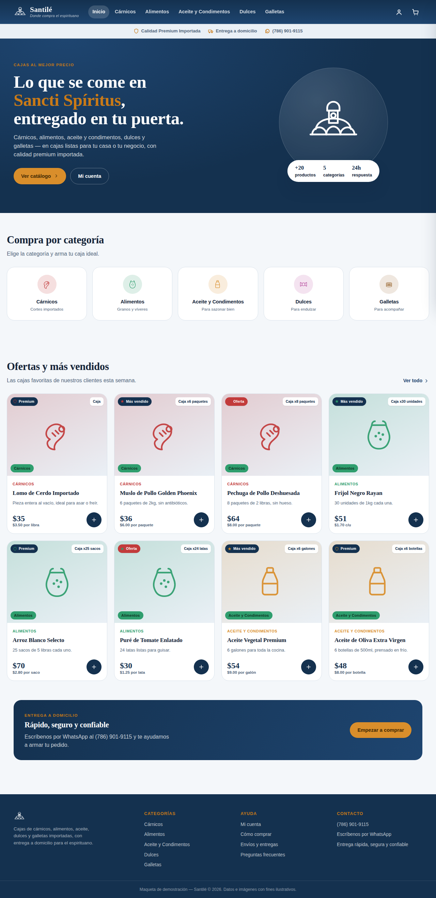
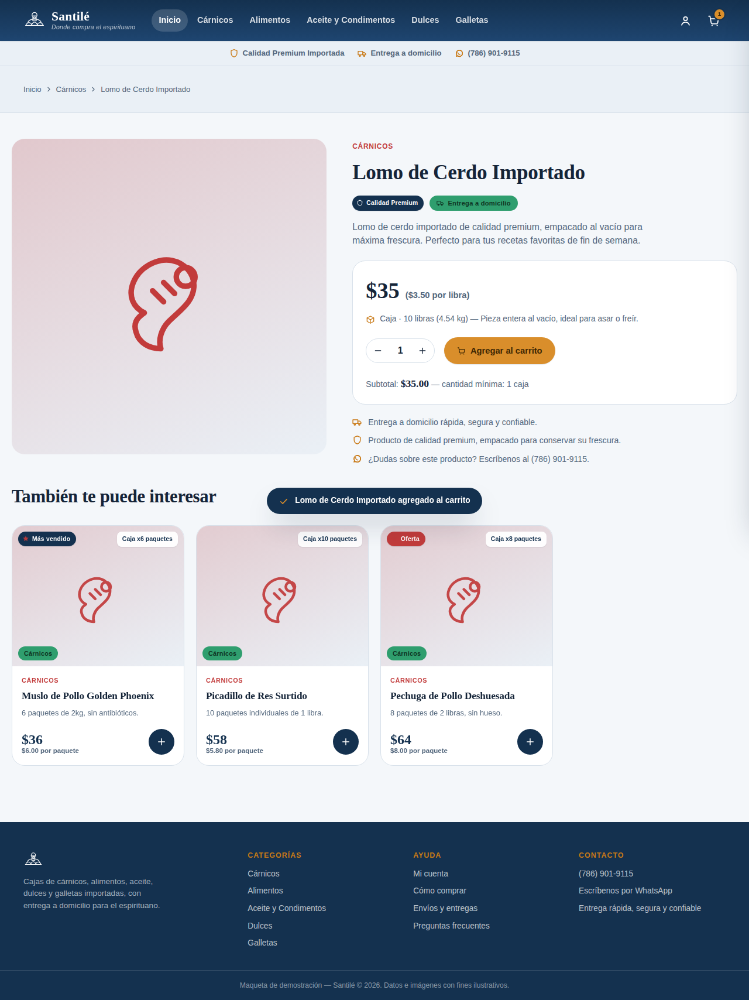
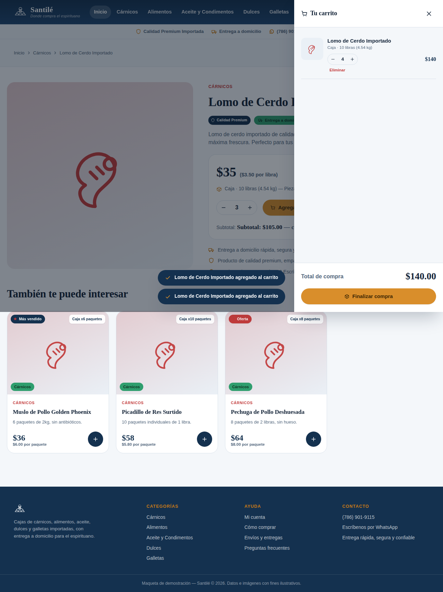
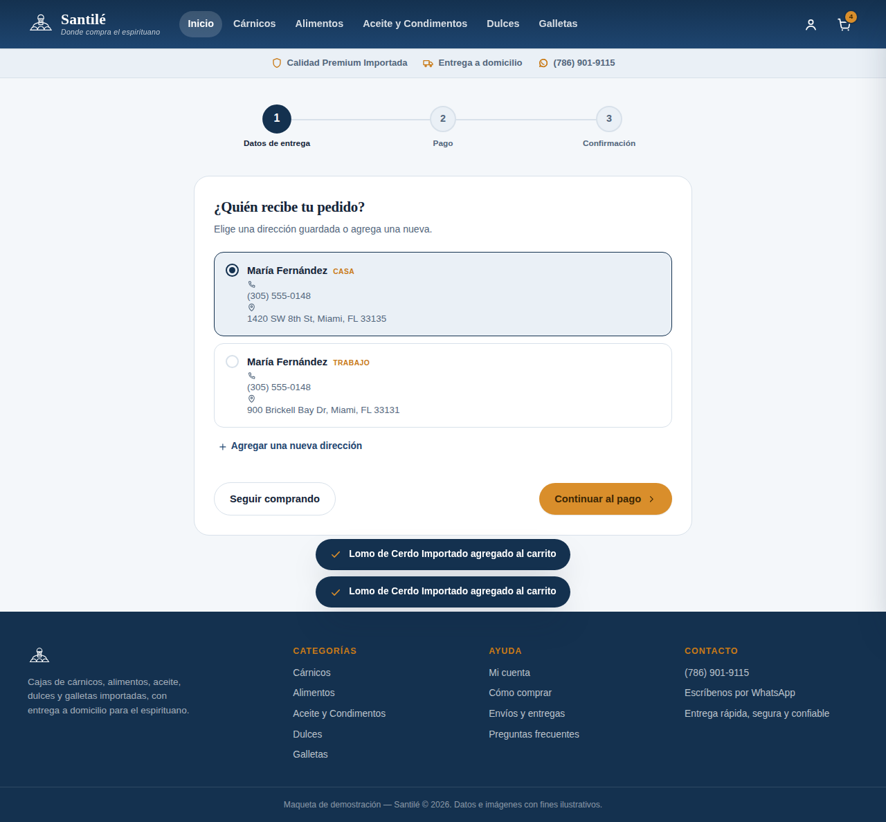
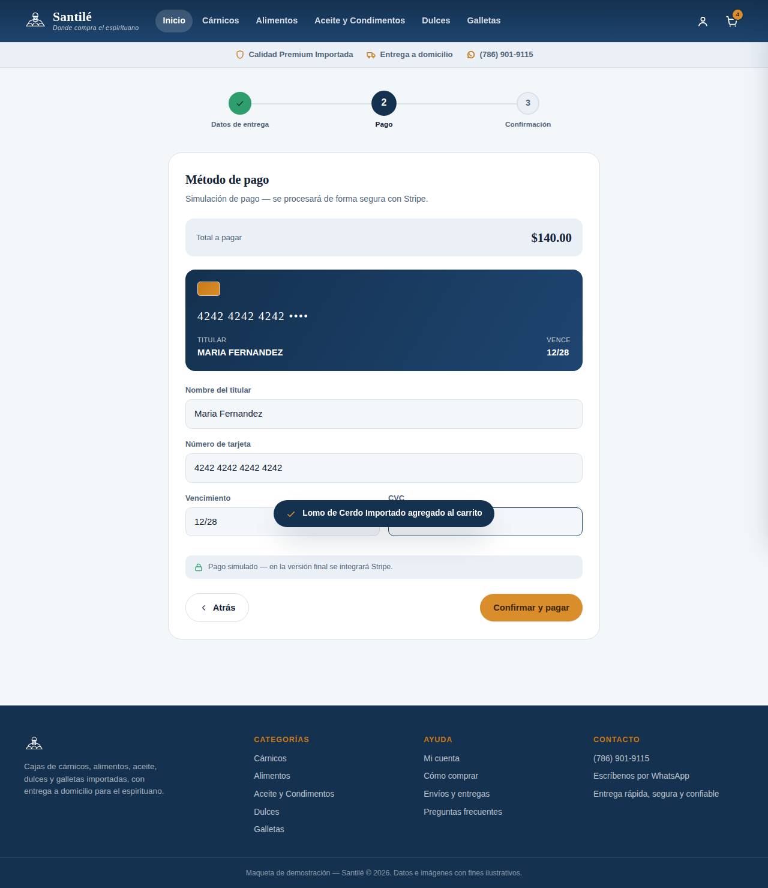
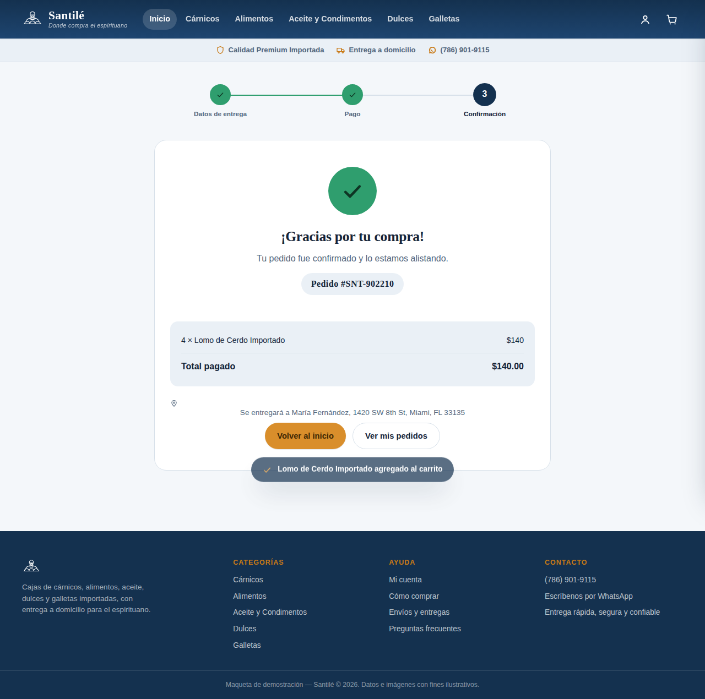
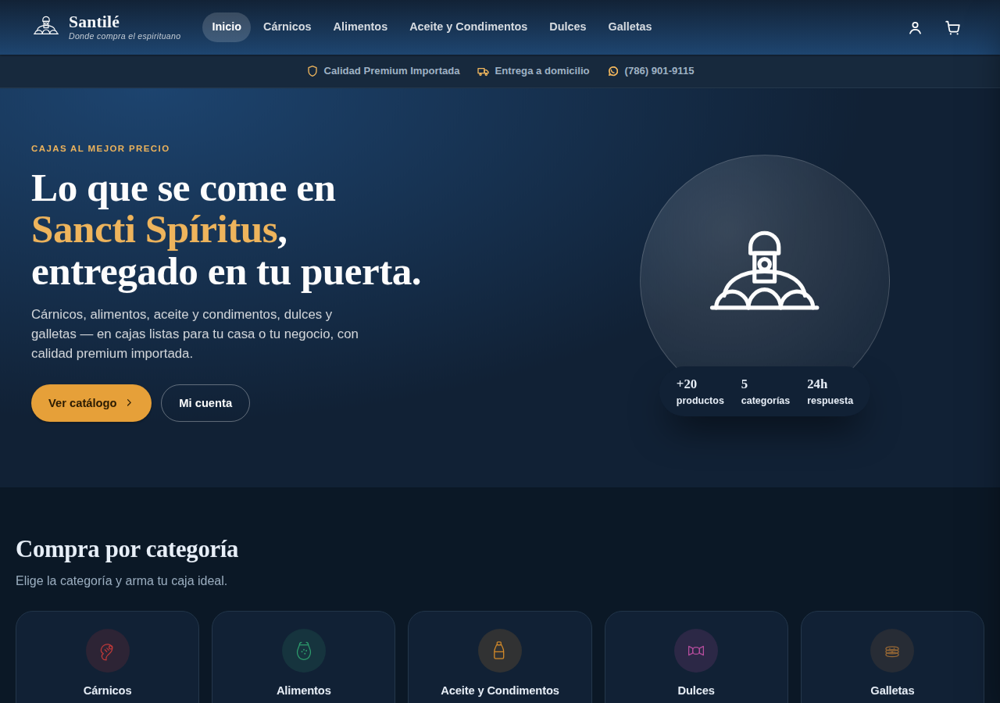
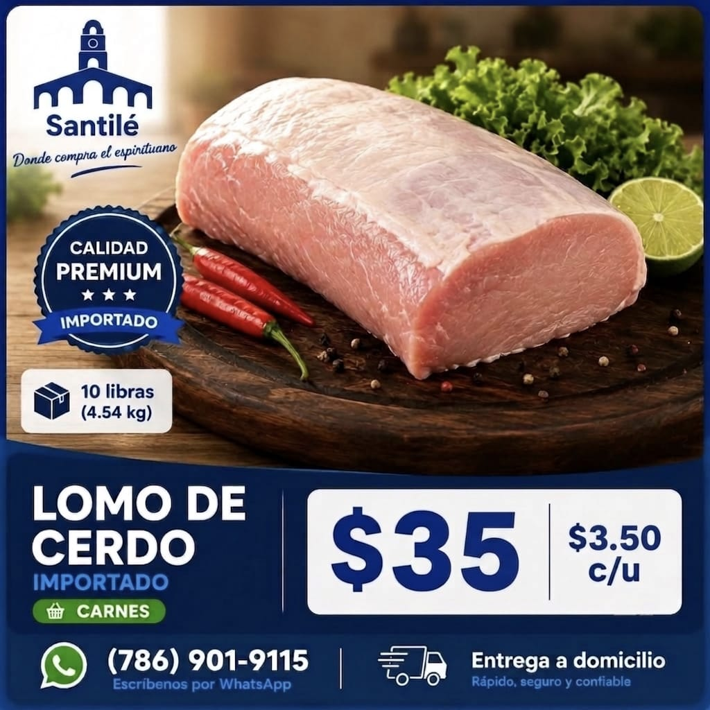
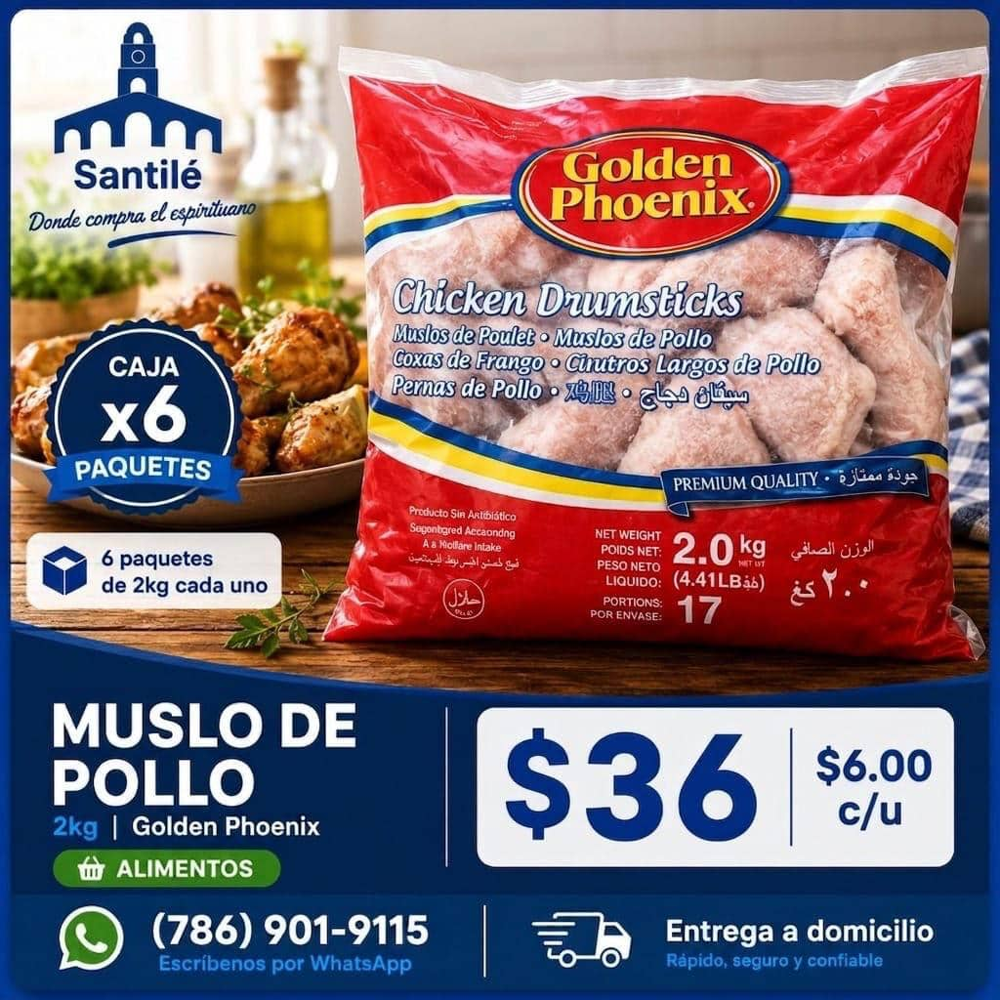
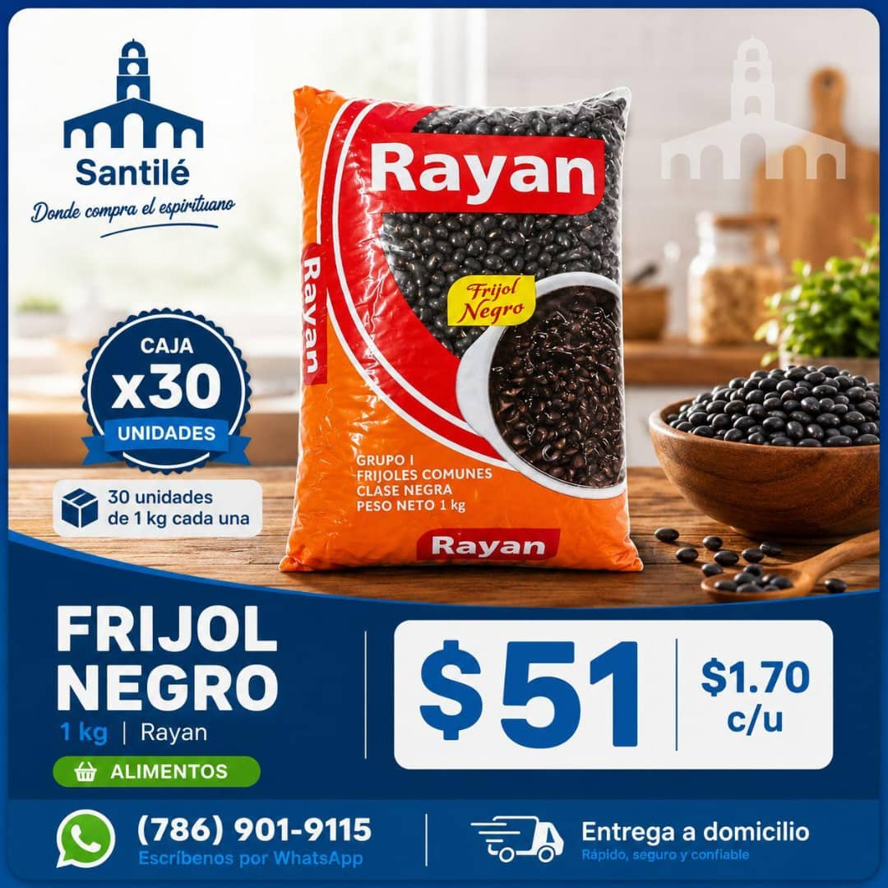

<p align="center">
  
</p>

<h1 align="center">Santilé</h1>
<p align="center"><em>Donde compra el espirituano</em></p>

## De qué va el proyecto

Santilé es un e-commerce de venta de cajas de productos (no unidades sueltas) pensado para
comunidad espirituana/cubana en el exterior que compra en volumen para su casa o para
revender. El cliente (Santana) comercializa cárnicos, alimentos, aceite y condimentos,
dulces y galletas, y hasta ahora vendía por WhatsApp mostrando fotos de anuncios como las
que están en [`docs/assets`](docs/assets).

El encargo inicial fue explícito: **antes de meterse con el backend, se necesitaba un front
bonito "para enamorar"** — una maqueta funcional y presentable que el cliente pudiera enseñar
para validar el producto, con datos hardcodeados donde hiciera falta.

Este repositorio es un **proyecto colaborativo hecho junto con Claude** (Anthropic): el
front-end de la maqueta fue diseñado e implementado por Claude a partir de las instrucciones
y las imágenes de referencia del cliente, y sigue iterando con nuevas peticiones sobre esta
misma base.

## Estado actual: maqueta de front-end

Todo lo que hay hoy en el repo es **una maqueta visual sin backend**. El carrito, las
direcciones, el pago y los pedidos viven en el navegador (`localStorage`), no en un servidor.
Es intencional: sirve para validar diseño y flujo con el cliente antes de invertir en
infraestructura real.

**No implementado todavía (siguiente fase):** backend/API, base de datos de productos e
inventario, autenticación real, pasarela de pago real (Stripe u otra), fotos reales de
producto, panel de administración.

## Funcionalidades de la maqueta

- **Catálogo por categoría**: Cárnicos, Alimentos, Aceite y Condimentos, Dulces, Galletas —
  20 productos de ejemplo, cada uno vendido **por caja** (no por lata/unidad suelta), tal
  como en los anuncios reales del cliente.
- **Ficha de producto** con insignias (Premium / Oferta / Más vendido), selector de cantidad
  de cajas y subtotal en vivo.
- **Carrito** en panel lateral: botones +/- por producto, eliminar, y total de compra visible
  antes del botón de finalizar compra.
- **Checkout en 3 pasos**: datos de quien recibe (elegir una dirección guardada del perfil o
  introducir una nueva) → pago (formulario simulado estilo Stripe) → confirmación con número
  de pedido.
- **Cuenta de usuario**: inicio de sesión simulado, direcciones guardadas (agregar/eliminar)
  e historial de pedidos.
- Responsivo (móvil/tablet/escritorio), modo claro y oscuro, microinteracciones (toasts,
  animaciones al agregar al carrito, transiciones del carrito y del checkout).

## Cómo verlo

- **Localmente**: abre `index.html` con doble clic en cualquier navegador. No necesita
  instalar nada ni levantar un servidor — es un único archivo autocontenido (HTML + CSS + JS).
- **Enlace en vivo para compartir**: pídele a quien tenga el proyecto abierto en Claude que
  genere/actualice el enlace de vista previa y lo comparta desde el menú de compartir de la
  página (los enlaces de vista previa son privados por defecto).

## Estructura del repositorio

```
Santile/
├── index.html          # La maqueta completa (front-end autocontenido)
├── README.md            # Este documento
└── docs/
    └── assets/
        ├── logo-santile.png            # Logotipo original de la marca
        ├── anuncio-lomo-de-cerdo.jpg    # Anuncio de referencia del cliente
        ├── anuncio-muslo-de-pollo.jpg   # Anuncio de referencia del cliente
        ├── anuncio-frijol-negro.jpg     # Anuncio de referencia del cliente
        └── capturas/                    # Capturas de la maqueta ya funcionando
```

## Capturas de la maqueta

| Inicio | Ficha de producto | Carrito |
|---|---|---|
|  |  |  |

| Checkout: datos | Checkout: pago | Confirmación |
|---|---|---|
|  |  |  |

| Modo oscuro |
|---|
|  |

## Anuncios de referencia del cliente

Estos son los anuncios que el cliente ya usaba por WhatsApp y que definieron la paleta de
colores, la tipografía de precios y el formato "caja x N unidades" que sigue la maqueta:

<p align="center">
  
  
  
</p>

## Próximos pasos

1. Validar la maqueta con el cliente y recoger cambios de contenido/diseño.
2. Definir catálogo real de productos, precios e inventario.
3. Construir el backend (API + base de datos) y sustituir los datos hardcodeados.
4. Integrar pago real (Stripe).
5. Autenticación de usuarios real y panel de administración de pedidos.
